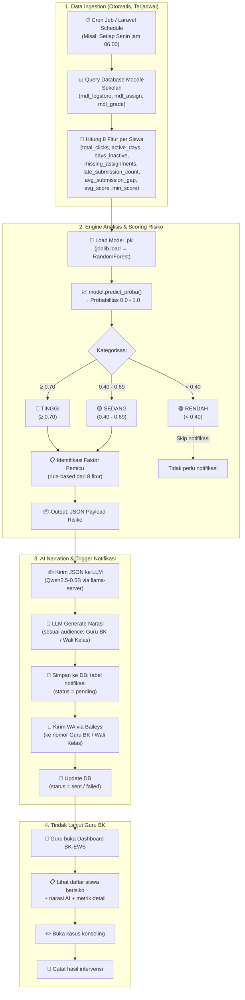

# Workflow Lengkap EWS BK — Dari Moodle Sampai WhatsApp Guru

## Masalah Intinya: Kamu Punya Potongan Puzzle, Tapi Belum Satu Gambar

Kamu sudah punya:
- ✅ Dashboard BK-EWS (Laravel + Inertia + React) — sistem sekolah yang sudah lengkap
- ✅ ML Model `.pkl` (RandomForest, dilatih dari dataset OULAD Moodle)
- ✅ Fungsi Python untuk generate JSON risiko + prompt LLM
- ✅ Rencana LLM lokal (Qwen2.5-0.5B via llama-server)
- ✅ Rencana WA gateway (Baileys)

Yang **belum ada** dan bikin bingung:
- ❌ **Lem penghubung** — bagaimana semua komponen ini saling bicara?
- ❌ **Urutan eksekusi** — siapa trigger siapa, kapan, dan bagaimana?
- ❌ **Jembatan data** — model dilatih dari OULAD, tapi data riil ada di Moodle sekolah

---

## Gambar Besar: Workflow End-to-End



---

## Penjelasan Setiap Tahap

### Tahap 1: Data Ingestion — Dari Mana Data Masuk?

> [!IMPORTANT]
> **Ini adalah gap terbesar yang belum dibahas siapapun.**
> Model kamu dilatih dari dataset OULAD (Open University Learning Analytics Dataset). Tapi di produksi, data harus datang dari **database Moodle riil sekolah**. Struktur tabelnya mirip tapi TIDAK identik.

**Sumber data riil Moodle sekolah:**

| Fitur Model (OULAD) | Sumber di Moodle Riil | Tabel Moodle |
|---|---|---|
| `total_clicks` | Total interaksi/log siswa | `mdl_logstore_standard_log` |
| `active_days` | Jumlah hari unik siswa login/aktif | `mdl_logstore_standard_log` |
| `days_inactive` | Selisih hari terakhir aktif vs hari ini | `mdl_logstore_standard_log` |
| `missing_assignments` | Tugas yang belum dikumpulkan | `mdl_assign_submission` + `mdl_assign` |
| `late_submission_count` | Tugas yang dikumpulkan terlambat | `mdl_assign_submission` (timemodified > duedate) |
| `avg_submission_gap` | Rata-rata jarak hari submit vs deadline | `mdl_assign_submission` + `mdl_assign` |
| `avg_score` | Rata-rata nilai | `mdl_grade_grades` |
| `min_score` | Nilai terendah | `mdl_grade_grades` |

**Yang harus kamu buat:** Script Python (atau Laravel Artisan Command) yang:
1. Connect ke database Moodle sekolah
2. Query tabel-tabel di atas
3. Hitung & agregasi jadi 8 fitur per siswa per course
4. Outputkan sebagai DataFrame yang siap diinferensi model

```
⚠️ CUT-OFF DAY = 60
Model dilatih dengan data 60 hari pertama semester.
Artinya di produksi, script ini harus jalan di sekitar minggu ke-8 hingga ke-10 semester
untuk mendapatkan prediksi yang akurat.
```

---

### Tahap 2: Engine Analisis — Model ML Beraksi

Setelah data 8 fitur per siswa tersedia, alur ini sudah **100% ready** dari notebook kamu:

```python
# Pseudocode — sudah ada di notebook
bundle = joblib.load('ews_moodle_model.pkl')
model = bundle['model']
features = bundle['features']
threshold = bundle['optimal_threshold']  # 0.40

# Untuk setiap siswa:
X = siswa_dataframe[features]
probabilities = model.predict_proba(X)[:, 1]  # kolom "berisiko"

# Filter yang perlu intervensi:
at_risk = siswa_dataframe[probabilities >= threshold]

# Generate JSON per siswa berisiko:
for idx, row in at_risk.iterrows():
    proba = probabilities[idx]
    json_payload = generate_ews_json(row, proba, threshold)
    # → Lanjut ke Tahap 3
```

**Output Tahap 2:** Daftar JSON payload, masing-masing berisi:
```json
{
  "student_profile": { "id_student": 65002, "code_module": "Matematika", ... },
  "risk_assessment": { "risk_level": "TINGGI", "risk_probability": 0.719, ... },
  "moodle_behavior_metrics": { "days_inactive": 50, "total_clicks": 3, ... },
  "detected_risk_factors": ["Tidak aktif 50 hari", "Akses materi sangat minim"]
}
```

---

### Tahap 3: AI Narration + Notifikasi — LLM & WA

Ini yang terjadi di **VPS** (Node.js `ews-notifier` service):

```
Untuk setiap JSON payload siswa berisiko:
  1. Buat prompt via create_slm_prompt(json, audience="guru_bk")
  2. Kirim ke llama-server (localhost:8080) → dapat teks narasi
  3. INSERT ke database:
     ┌──────────────────────────────────────────────────┐
     │ tabel: notifikasi                                 │
     │ - id_siswa: 65002                                 │
     │ - kategori_risiko: "TINGGI"                       │
     │ - skor_risiko: 72                                 │
     │ - faktor_kunci: ["Tidak aktif 50 hari", ...]      │
     │ - narasi_generated: "Bapak/Ibu, sistem..."        │
     │ - guru_target: "Wali Kelas XII RPL"               │
     │ - status: "pending"                               │
     │ - created_at: 2026-09-08 06:00:00                 │
     └──────────────────────────────────────────────────┘
  4. Kirim via Baileys ke WA guru (dengan jeda 3-8 detik antar pesan)
  5. UPDATE status → "sent" atau "failed"
```

---

### Tahap 4: Tindak Lanjut — Dashboard Jadi Sumber Kebenaran

Guru BK membuka dashboard Laravel BK-EWS dan melihat:

```
┌─────────────────────────────────────────────────────────┐
│  📊 DASHBOARD EWS - BIMBINGAN KONSELING                 │
│                                                          │
│  Siswa Berisiko Minggu Ini: 7 siswa                     │
│                                                          │
│  🔴 TINGGI (3)  🟡 SEDANG (4)                           │
│                                                          │
│  ┌─────────────────────────────────────────────────┐     │
│  │ 🔴 Ahmad R. - XII RPL - Skor: 72               │     │
│  │    Tidak aktif 50 hari, 0 tugas dikumpulkan     │     │
│  │    [Lihat Detail] [Buka Kasus] [Jadwal BK]      │     │
│  ├─────────────────────────────────────────────────┤     │
│  │ 🔴 Sinta W. - XI MM - Skor: 85                 │     │
│  │    Nilai rata-rata 32, 4x terlambat submit      │     │
│  │    [Lihat Detail] [Buka Kasus] [Jadwal BK]      │     │
│  └─────────────────────────────────────────────────┘     │
│                                                          │
│  📱 Status Notifikasi WA: 5 sent, 2 failed (retry?)     │
│                                                          │
└─────────────────────────────────────────────────────────┘
```

Ketika guru klik **[Lihat Detail]**, mereka melihat:
- Narasi yang di-generate AI
- Grafik aktivitas siswa di Moodle (klik per minggu, dll)
- Riwayat konseling sebelumnya (jika ada)
- Form untuk mencatat hasil intervensi

---

## Peta Komponen: Apa di Mana?

```
┌──────────────────────────────────────────────────┐
│  SERVER UTAMA (Hosting Dashboard)                 │
│                                                    │
│  Laravel BK-EWS                                    │
│  ├── Dashboard (Inertia + React)                  │
│  ├── Database MySQL/PostgreSQL                    │
│  │   ├── tabel users (guru, kepsek)               │
│  │   ├── tabel siswa                              │
│  │   ├── tabel notifikasi  ← BARU                 │
│  │   └── tabel konseling   ← BARU                 │
│  ├── Artisan Command: ews:fetch-moodle            │
│  │   (ambil data dari Moodle DB → hitung 8 fitur) │
│  └── API endpoint untuk ews-notifier              │
│                                                    │
└──────────────┬───────────────────────────────────┘
               │ HTTP API
               ▼
┌──────────────────────────────────────────────────┐
│  VPS (Model + LLM + WA Gateway)                   │
│                                                    │
│  ews-notifier (Node.js, 1 proses)                 │
│  ├── Terima data siswa berisiko dari Laravel API  │
│  ├── Load .pkl (via child process Python)          │
│  │   ATAU terima JSON hasil inferensi dari Laravel│
│  ├── Panggil llama-server → generate narasi       │
│  ├── Kirim hasil ke Laravel API (simpan ke DB)    │
│  └── Kirim WA via Baileys                         │
│                                                    │
│  llama-server                                      │
│  └── Qwen2.5-0.5B-Instruct (~500-580 MB RAM)     │
│                                                    │
└──────────────────────────────────────────────────┘
               │
               ▼
┌──────────────────────────────────────────────────┐
│  DATABASE MOODLE SEKOLAH                          │
│  (Bisa di server yang sama atau beda)             │
│                                                    │
│  mdl_logstore_standard_log (log aktivitas)        │
│  mdl_assign / mdl_assign_submission (tugas)       │
│  mdl_grade_grades (nilai)                         │
│  mdl_user (data siswa)                            │
│  mdl_course (data mata pelajaran)                 │
│                                                    │
└──────────────────────────────────────────────────┘
```

---

## Gap Kritis yang Harus Diselesaikan

### Gap 1: Jembatan OULAD → Moodle Riil

Model dilatih dengan nama kolom OULAD:
- `code_module` → di Moodle riil: `mdl_course.shortname`
- `code_presentation` → di Moodle riil: Semester/tahun ajaran
- `id_student` → di Moodle riil: `mdl_user.id` atau NISN

**Kamu perlu:** Script ETL (Extract-Transform-Load) yang mengubah data Moodle riil ke format yang model harapkan. Ini bisa berupa:
- Laravel Artisan Command (`php artisan ews:extract-features`)
- Atau Python script terpisah yang dijalankan cron

### Gap 2: Koneksi Dashboard ↔ VPS

Dashboard Laravel dan VPS ews-notifier harus bisa komunikasi. Opsi:

| Opsi | Bagaimana | Pro | Kontra |
|---|---|---|---|
| **A. Laravel trigger VPS** | Laravel kirim HTTP request ke VPS setelah fitur diekstrak | Dashboard punya kontrol penuh | VPS harus expose API, perlu auth |
| **B. VPS poll Laravel** | VPS cron tiap X menit cek Laravel API untuk data baru | VPS independen | Polling tidak efisien |
| **C. Shared Database** | VPS langsung baca/tulis ke DB Laravel | Paling sederhana | Tight coupling, risky |

> [!TIP]
> **Rekomendasi: Opsi A** — Laravel jadi orchestrator utama.
> Flow: Laravel cron → extract fitur dari Moodle → kirim ke VPS → VPS inferensi + LLM + WA → VPS kirim hasil balik ke Laravel → Laravel simpan ke DB.

### Gap 3: Mapping Siswa ke Guru

Model outputkan risiko per siswa, tapi WA harus dikirim ke **guru yang tepat**. Kamu butuh tabel mapping:

```sql
-- Di database Laravel
CREATE TABLE guru_kelas_mapping (
    id BIGINT PRIMARY KEY AUTO_INCREMENT,
    user_id BIGINT REFERENCES users(id),     -- ID guru
    siswa_id BIGINT REFERENCES siswa(id),    -- ID siswa
    role ENUM('wali_kelas', 'guru_bk'),
    no_wa VARCHAR(15),
    tahun_ajaran VARCHAR(10),
    created_at TIMESTAMP DEFAULT CURRENT_TIMESTAMP
);
```

---

## Alur Waktu: Kapan Apa Terjadi?

```
SEMESTER BERJALAN
━━━━━━━━━━━━━━━━━━━━━━━━━━━━━━━━━━━━━━━━━━━━━━━━━━━━━

Minggu 1-4:  Data Moodle mulai terkumpul (siswa login, submit tugas)
             → Belum cukup data untuk prediksi akurat

Minggu 5-8:  Data mulai bermakna
             → Bisa mulai trial run (tanpa kirim notifikasi asli)

Minggu 9+:   CUT-OFF DAY 60 tercapai ✅
             → Prediksi model jadi akurat
             → Mulai kirim notifikasi asli ke guru

Setiap Senin jam 06.00 (setelah minggu ke-9):
  06:00  Laravel cron: php artisan ews:extract-features
         → Query Moodle DB, hitung 8 fitur per siswa
  06:05  Laravel kirim data ke VPS ews-notifier
  06:06  VPS load .pkl, inferensi semua siswa
  06:10  VPS kirim JSON siswa berisiko ke llama-server
  06:15  LLM selesai generate narasi untuk semua siswa
  06:16  VPS kirim hasil ke Laravel API → simpan ke DB
  06:17  VPS mulai kirim WA satu-satu (jeda 3-8 detik)
  06:25  Semua notifikasi terkirim ✅

  07:00  Guru BK buka dashboard, lihat daftar siswa berisiko
  07:30  Guru BK mulai jadwalkan sesi konseling
```

---

## Kesimpulan: Apa yang Harus Dikerjakan, Urut Prioritas

| # | Task | Di Mana | Status |
|---|---|---|---|
| 1 | Buat script ETL: Moodle DB → 8 fitur model | Laravel / Python | ❌ Belum ada |
| 2 | Test model .pkl dengan data Moodle riil | Python lokal | ❌ Belum ada |
| 3 | Tambah tabel `notifikasi` + `konseling` di DB Laravel | Laravel Migration | ❌ Belum ada |
| 4 | Buat API endpoint di Laravel untuk terima/kirim data EWS | Laravel Controller | ❌ Belum ada |
| 5 | Install llama-server + Qwen2.5-0.5B di VPS | VPS | ❌ Belum ada |
| 6 | Buat ews-notifier (Node.js: inferensi → LLM → DB → WA) | VPS | ❌ Belum ada |
| 7 | Mapping guru ↔ siswa ↔ nomor WA | Laravel DB | ❌ Belum ada |
| 8 | Halaman dashboard EWS di frontend React | Laravel/React | ❌ Belum ada |

> [!IMPORTANT]
> **Mulai dari #1 dan #2.** Tanpa jembatan data OULAD → Moodle riil, semua komponen lain tidak ada gunanya. Ini fondasi yang menentukan apakah model-mu bisa dipakai di dunia nyata atau tidak.
