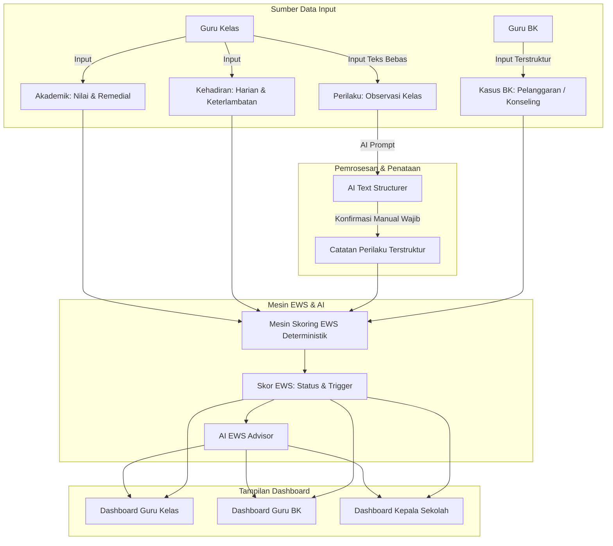
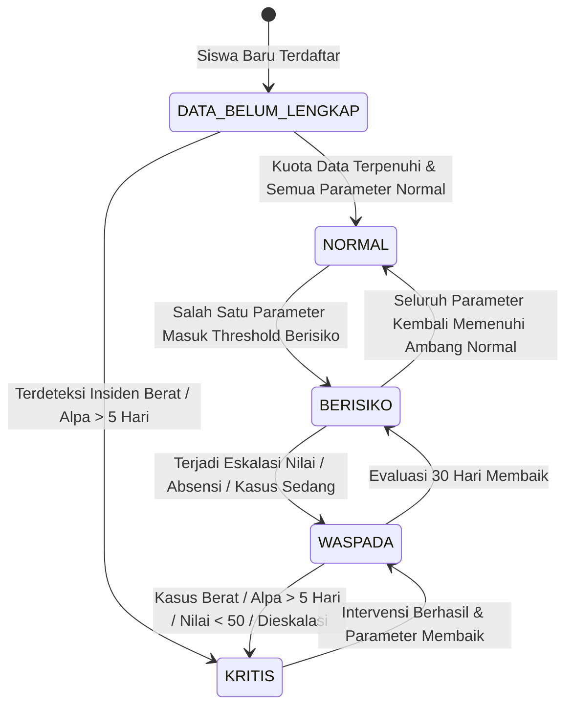
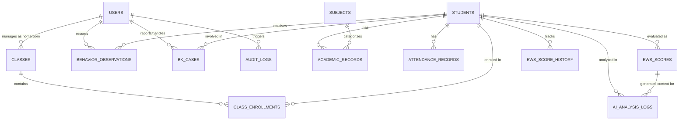
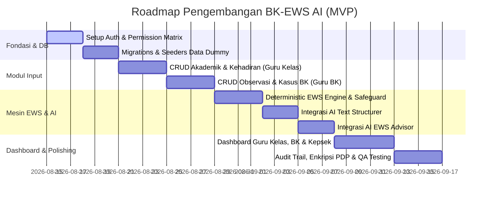

# Product Requirement Document (PRD)
# Sistem Informasi Bimbingan Konseling (BK) dengan AI Early Warning System (EWS)

| Atribut Dokumen | Keterangan |
|---|---|
| **Nama Produk** | Sistem BK-EWS AI (Bimbingan Konseling & Early Warning System) |
| **Versi Dokumen** | 2.0 (Engineering & AI-Ready Specification) |
| **Tanggal Pembaruan** | 14 Agustus 2026 |
| **Status Dokumen** | Approved for Specification & Development |
| **Tech Stack Acuan** | Laravel 13, Inertia.js (React + TypeScript), Tailwind CSS v4, PostgreSQL/MySQL, LLM API (Google Gemini / OpenAI compatible) |

---

## 1. Ringkasan Eksekutif & Problem Statement

### 1.1 Latar Belakang Masalah
Di lingkungan sekolah menengah, deteksi dini terhadap siswa yang mengalami kendala akademik, disrupsi perilaku, absensi kronis, maupun krisis psikososial sering kali terlambat karena:
1. **Silo Data:** Catatan nilai dipegang guru kelas/mapel, catatan absensi ada di rekap piket/wali kelas, dan riwayat konseling tersimpan di ruang BK tanpa integrasi data terpadu.
2. **Beban Administratif Guru:** Guru enggan mencatat observasi harian karena formulir yang kaku atau proses dokumentasi naratif yang memakan waktu.
3. **Keterbatasan Visibilitas Kepala Sekolah:** Kepala Sekolah membutuhkan gambaran agregat kesehatan iklim sekolah dan peringatan dini saat ada parameter yang melompat melewati batas bahaya, tanpa melanggar kerahasiaan konseling personal siswa.

### 1.2 Solusi Produk
Sistem BK-EWS AI adalah platform web terpadu yang menggabungkan:
- **Pencatatan Terstruktur Multi-Kanal:** Input nilai, absensi, observasi perilaku harian, dan pencatatan kasus BK.
- **AI Text Structuring (Human-in-the-Loop):** Merapikan catatan observasi bebas guru menjadi kategori perilaku terstandar secara instan sebelum disimpan.
- **Deterministic EWS Scoring Engine:** Mesin kalkulasi aturan deterministik (threshold-based worst-case evaluation) dengan safeguard data tidak lengkap.
- **AI Advisor:** Mesin penjelas (analisis naratif komprehensif) dan generator rekomendasi intervensi pedagogis/konseling untuk Guru Kelas, Guru BK, dan Kepala Sekolah.
- **Governance & UU PDP Compliance:** Enkripsi data sensitif, audit logging ketat, dan pembatasan akses kasus BK berjenjang.

---

## 2. Tujuan & Batasan Produk (Scope & Non-Goals)

### 2.1 Tujuan Utama (Goals)
1. **Deteksi Dini Konsisten:** Mengidentifikasi siswa berisiko secara objektif melalui 4 tingkatan status: `NORMAL`, `BERISIKO`, `WASPADA`, dan `KRITIS`.
2. **Efisiensi Input Guru:** Memangkas waktu input catatan perilaku dengan AI autocomplete (< 5 detik per input) disertai konfirmasi manual wajib.
3. **Fokus Intervensi Kepala Sekolah:** Memberikan navigasi *exception-based* bagi Kepsek untuk memprioritaskan siswa/parameter yang melewati ambang bahaya terlebih dahulu.
4. **Kepatuhan Privasi Data:** Mematuhi UU PDP dalam pengelolaan data pribadi anak dan rekam konseling konselor.

### 2.2 Batasan Fase MVP (Non-Goals)
| Fitur / Alur | Alasan Dikecualikan dari MVP |
|---|---|
| **Portal / Akses Login Siswa** | Mencegah pelabelan diri (*self-stigmatization*) dan dampak psikologis tanpa pendampingan langsung konselor. |
| **Notifikasi Otomatis ke Orang Tua** | Keputusan pemanggilan atau pelibatan orang tua sepenuhnya merupakan diskresi manusia (Guru BK & Wali Kelas). |
| **Pemberian Skor / Keputusan Otomatis oleh AI** | AI hanya berfungsi sebagai *text structurer* dan *narrative advisor*. Seluruh skoring EWS dieksekusi oleh mesin aturan deterministik kode. |
| **Integrasi Dapodik / Sinkronisasi Eksternal** | MVP difokuskan pada data mandiri sekolah / dummy dataset untuk validasi internal. |

---

## 3. Matriks Hak Akses & Tata Kelola Data (RBAC & PDP Governance)

### 3.1 Definisi Role Pengguna
1. **`guru_kelas` (Guru Kelas / Wali Kelas):** Bertanggung jawab atas input nilai akademik siswa, pencatatan absensi harian, dan pencatatan observasi perilaku di kelasnya.
2. **`guru_bk` (Guru Bimbingan Konseling):** Bertanggung jawab atas pengelolaan portofolio konseling, input kasus BK, penetapan tindakan penanganan, dan tindak lanjut siswa di sekolah.
3. **`kepsek` (Kepala Sekolah):** Memiliki hak pantau level manajerial terhadap seluruh data akademik, kehadiran, perilaku, status EWS, dan laporan agregat sekolah. Khusus kasus BK, Kepsek **hanya** dapat mengakses kasus yang melewati ambang batas (`WASPADA` / `KRITIS`) atau berstatus `"DIESKALASI_KE_KEPSEK"`.

### 3.2 Permission Matrix (Data & Modul)

| Modul & Entitas | Guru Kelas | Guru BK | Kepala Sekolah |
|---|---|---|---|
| **Data Akademik (Nilai UH/UTS/UAS/Tugas)** | Create, Read, Update (Siswa Kelas Sendiri) | Read (Semua Siswa) | Read (Semua Siswa) |
| **Absensi Harian & Jam Hadir** | Create, Read, Update (Siswa Kelas Sendiri) | Read (Semua Siswa) | Read (Semua Siswa) |
| **Observasi Perilaku Kelas** | Create, Read, Update (Siswa Kelas Sendiri) | Read (Semua Siswa) | Read (Semua Siswa) |
| **Kasus BK - Kategori Ringan/Sedang** | No Access | Create, Read, Update, Delete (Semua Kasus BK) | No Access |
| **Kasus BK - Status Waspada/Kritis / Dieskalasi** | No Access | Create, Read, Update, Delete (Semua Kasus BK) | Read Only |
| **Status & Riwayat Skor EWS** | Read (Siswa Kelas Sendiri) | Read (Semua Siswa) | Read (Semua Siswa) |
| **AI Advisor (Rekomendasi)** | Read (Siswa Kelas Sendiri) | Read (Semua Siswa) | Read (Semua Siswa + Executive Summary) |
| **Manajemen Pengguna & Konfigurasi** | No Access | No Access | Full Access (Superadmin) |

### 3.3 Penegakan Keamanan Tingkat Kueri (Backend Enforcement)
> [!IMPORTANT]
> Pembatasan data kasus BK untuk role `kepsek` **wajib ditegakkan di level kueri database (Eloquent Scope / Query Builder)**, bukan sekadar disembunyikan pada antarmuka pengguna (UI):
> ```sql
> -- Logika Scope Kasus BK untuk Kepsek:
> WHERE bk_cases.severity IN ('BERAT') 
>    OR bk_cases.status = 'DIESKALASI_KE_KEPSEK'
>    OR EXISTS (
>       SELECT 1 FROM ews_scores 
>       WHERE ews_scores.student_id = bk_cases.student_id 
>         AND ews_scores.status IN ('WASPADA', 'KRITIS')
>    )
> ```

---

## 4. Parameter & Spesifikasi Input Data



### 4.1 Parameter Akademik (Input: `Guru Kelas`)
- **Tipe Penilaian:** `TUGAS`, `UH` (Ulangan Harian), `UTS` (Ujian Tengah Semester), `UAS` (Ujian Akhir Semester).
- **Rentang Nilai:** `0` s/d `100` (float/decimal 2 digit).
- **Mata Pelajaran:** Relasi ke tabel master `subjects`.
- **Status Remedial:** Boolean flag (`is_remedial`) dan nilai sebelum perbaikan.

### 4.2 Parameter Kehadiran (Input: `Guru Kelas`)
- **Status Kehadiran Harian:** `HADIR`, `SAKIT`, `IZIN`, `ALPA`, `TERLAMBAT`.
- **Waktu Masuk Aktual:** Timestamp jam kedatangan (mendeteksi deviasi keterlambatan kronis dalam menit).
- **Periode Evaluasi:** Rolling 30 hari & Kumulatif Semester Berjalan.

### 4.3 Parameter Observasi Perilaku (Input: `Guru Kelas`)
- **Input Mentah:** Teks bebas catatan observasi guru (misal: *"Anak terlihat murung 3 hari ini dan menolak kerja kelompok"*).
- **Output Terstruktur AI (Wajib Konfirmasi Guru):**
  - **Kategori:** `MENARIK_DIRI`, `AGRESIF_FISIK`, `AGRESIF_VERBAL`, `TIDAK_FOKUS`, `PELANGGARAN_ATURAN`, `PERILAKU_POSITIF`.
  - **Tingkat Keparahan:** `RINGAN`, `SEDANG`, `BERAT`.
- **Fallback:** Guru dapat mengganti kategori/tingkat keparahan via dropdown manual jika tidak setuju dengan hasil AI.

### 4.4 Parameter Kasus Bimbingan Konseling (Input: `Guru BK`)
- **D1. Taksonomi Kasus (Multi-Select):**
  1. `TATA_TERTIB` (Pelanggaran atribut, seragam, keterlambatan masif)
  2. `KEKERASAN_FISIK` (Perkelahian, pemukulan, penganiayaan)
  3. `BULLYING` (Perundungan) — Sub-peran: `KORBAN` / `PELAKU` / `SAKSI`
  4. `KONFLIK_SOSIAL` (Perselisihan non-fisik, pengucilan kelompok)
  5. `ABSENSI_KRONIS` (Eskalasi alpa berkepanjangan)
  6. `BARANG_TERLARANG` (Rokok/Vape, senjata tajam, obat terlarang, gadget saat ujian)
  7. `KONFLIK_GURU` (Pembangkangan, ketidaksopanan ekstrem terhadap staf)
  8. `KECURANGAN_AKADEMIK` (Mencontek massal, plagiarisme, kebocoran soal)
  9. `KONSELING_PERSONAL` (Isu psikologis/keluarga — *kategori umum, catatan rahasia tidak disimpan*)
  10. `LAINNYA` (Label singkat kustom)
- **D2. Tingkat Keparahan:** `RINGAN`, `SEDANG`, `BERAT`.
- **D3. Status Penanganan:** `BARU_DILAPORKAN` $\rightarrow$ `DALAM_PROSES` $\rightarrow$ `DIESKALASI_KE_KEPSEK` $\rightarrow$ `DIRUJUK_EKSTERNAL` $\rightarrow$ `SELESAI`.
- **D4. Tindak Lanjut (Multi-Select):** `TEGURAN_LISAN`, `SURAT_PERNYATAAN`, `PANGGILAN_ORANG_TUA`, `SKORSING`, `RUJUKAN_PSIKOLOG`, `MEDIASI_PEER`, `MONITORING_RUTIN`.
- **D5. Metadata:** Tanggal insiden, tanggal laporan, jumlah siswa terlibat (numerik anonim).

---

## 5. Mesin Skoring EWS (Deterministic Rules & State Machine)

### 5.1 Prinsip Fundamental Skoring
1. **Paradigma Max-Severity (Worst-Case Threshold):** Status akhir siswa ditentukan oleh **tingkat keparahan parameter terburuk** di antara 4 pilar (Akademik, Kehadiran, Perilaku, BK).
2. **Safeguard Data Kosong (Null-Safety):** Data yang belum diinput (`NULL`) **tidak boleh** diasumsikan sebagai performa buruk. Kategori yang belum memiliki data minimum tidak ikut mengevaluasi status.
3. **Status Data Belum Lengkap:** Jika jumlah data belum memenuhi kuota minimum, siswa diberi status `DATA_BELUM_LENGKAP` (bukan dipaksa berstatus Normal/Berisiko).

### 5.2 Ambang Batas Evaluasi Pilar (Threshold Matrix)

| Pilar Evaluasi | NORMAL (Hijau) | BERISIKO (Kuning) | WASPADA (Oranye) | KRITIS (Merah) |
|---|---|---|---|---|
| **1. Rata-rata Akademik** | $\ge 75.0$ | $65.0 - 74.9$ | $50.0 - 64.9$ | $< 50.0$ |
| **2. Tren Akademik** | Stabil / Naik | Turun 2 periode | Turun 3+ periode | Turun drastis ($>25$ poin) |
| **3. Persentase Hadir (30 Hari)** | $\ge 95.0\%$ | $90.0\% - 94.9\%$ | $80.0\% - 89.9\%$ | $< 80.0\%$ |
| **4. Alpa Berurutan** | 0 hari | $1 - 2$ hari | $3 - 5$ hari | $> 5$ hari berturut-turut |
| **5. Pelanggaran Perilaku (Smt)** | 0 kejadian | $1 - 2$ Ringan | $3 - 5$ Ringan / 1 Sedang | $>5$ Ringan / $\ge 2$ Sedang / 1 Berat |
| **6. Kasus BK Aktif (Smt)** | 0 kasus | 1 Kasus Ringan | 1 Kasus Sedang / 2+ Ringan | 1 Kasus Berat / Status Dieskalasi |

### 5.3 Aturan Kuota Minimum Data (Data Completeness Gate)
Untuk dapat menghasilkan status evaluasi aktif (`NORMAL` / `BERISIKO` / `WASPADA` / `KRITIS`), siswa harus memenuhi minimal:
- **Akademik:** Minimal $\ge 2$ nilai mata pelajaran pada semester aktif.
- **Kehadiran:** Minimal $\ge 5$ hari pencatatan absensi pada 30 hari kalender terakhir.
- *Jika salah satu pilar belum memenuhi kuota dan pilar lainnya tidak berada pada status `WASPADA`/`KRITIS`, status global siswa adalah `DATA_BELUM_LENGKAP`.*
- *Pengecualian Kritis:* Jika terjadi 1 Kasus BK kategori `BERAT` atau Alpa $\ge 5$ hari, status siswa **langsung melompat ke `KRITIS`** tanpa menunggu kelengkapan data pilar lain.

### 5.4 State Machine Transisi Status Siswa



---

## 6. Spesifikasi Sistem AI & Kontrak Payload

### 6.1 Modul AI Text Structuring (Autocomplete Observasi)
- **Tujuan:** Mengonversi teks observasi guru bahasa Indonesia non-formal menjadi JSON kategori terstandar.
- **Waktu Eksekusi (SLA):** $\le 4$ detik.
- **Skema JSON Input/Output:**

```json
// Input Payload ke LLM Service:
{
  "action": "STRUCTURE_BEHAVIOR_OBSERVATION",
  "raw_text": "Kemarin pas ulangan ketahuan buka contekan di bawah meja dan pas ditegur malah membentak guru pengawas",
  "allowed_categories": ["MENARIK_DIRI", "AGRESIF_FISIK", "AGRESIF_VERBAL", "TIDAK_FOKUS", "PELANGGARAN_ATURAN", "PERILAKU_POSITIF"],
  "allowed_severities": ["RINGAN", "SEDANG", "BERAT"]
}

// Output Expected dari LLM Service:
{
  "category": "PELANGGARAN_ATURAN",
  "sub_category": "KECURANGAN_DAN_KETIDAK_SOPANAN",
  "severity": "SEDANG",
  "summary": "Mencontek saat ulangan dan bersikap tidak sopan (membentak) saat ditegur pengawas",
  "suggested_follow_up": "Peringatan tertulis dan mediasi dengan guru pengawas",
  "confidence_score": 0.95
}
```

### 6.2 Modul AI EWS Advisor (Analisis & Rekomendasi)
- **Tujuan:** Menyusun ringkasan naratif multi-dimensi dan rekomendasi tindakan intervensi bagi pihak sekolah.
- **Prinsip Anonimisasi UU PDP:** Nama dan NIS siswa **wajib di-pseudonimkan** sebelum dikirim ke API eksternal (misal: `Siswa #SUBJ-8821`, Gender: `L`, Kelas: `10-IPA-2`).
- **Skema JSON Input/Output AI Advisor:**

```json
// Input Context ke AI Advisor:
{
  "student_pseudo_id": "SUBJ-8821",
  "grade_level": "Kelas 10",
  "current_ews_status": "WASPADA",
  "triggered_parameters": ["ALPA_BERUNTUN_4_HARI", "AKADEMIK_TURUN_2_PERIODE"],
  "academic_summary": {"average": 62.5, "trend": "DECREASING_2_PERIODS", "lowest_subject": "Matematika (45)"},
  "attendance_summary": {"rate_30_days": "82%", "consecutive_alpha": 4},
  "behavior_summary": {"recent_violations": 1, "severity": "SEDANG"},
  "bk_cases_summary": {"active_cases": 0}
}

// Output Response dari AI Advisor:
{
  "risk_overview": "Siswa menunjukkan penurunan performa akademik bersamaan dengan lonjakan absensi tanpa keterangan (4 hari beruntun), mengindikasikan potensi disengagement atau masalah personal di luar sekolah.",
  "primary_concerns": [
    "Ketidakhadiran berurutan 4 hari tanpa surat keterangan sakit/izin.",
    "Nilai Matematika anjlok ke angka 45 yang memicu penurunan tren nilai umum."
  ],
  "recommendations": {
    "for_homeroom_teacher": "Lakukan kontak langsung via telepon/kunjungan rumah untuk memverifikasi kondisi kesehatan/keluarga siswa.",
    "for_counselor_bk": "Jadwalkan sesi konseling suportif segera setelah siswa kembali hadir, fokus pada kendala belajar Matematika dan motivasi.",
    "for_principal": "Pantau status kehadiran siswa dalam 3 hari ke depan; jika alpa mencapai 5 hari, jadwalkan pemanggilan resmi orang tua."
  },
  "data_limitation_note": "Data observasi perilaku kelas masih terbatas (baru 1 entri), analisis bertumpu pada absensi dan nilai."
}
```

---

## 7. Desain Skema Basis Data (Database Schema Architecture)



### 7.1 Definisi Entitas & Kamus Data

#### 1. Tabel `users` & `roles`
- `id` (UUID / BigInt, PK)
- `name` (VARCHAR 255)
- `email` (VARCHAR 255, Unique)
- `password` (VARCHAR 255)
- `role` (ENUM: `'guru_kelas'`, `'guru_bk'`, `'kepsek'`)
- `created_at`, `updated_at`

#### 2. Tabel `classes`, `students`, `class_enrollments`
- `classes`: `id`, `name` (VARCHAR 50), `homeroom_teacher_id` (FK -> `users.id`)
- `students`: `id` (UUID/BigInt, PK), `nis` (VARCHAR 50, Unique), `nisn` (VARCHAR 50, Unique), `name` (VARCHAR 255), `gender` (ENUM: `'L'`, `'P'`), `status` (ENUM: `'AKTIF'`, `'LULUS'`, `'PINDAH'`, `'NON_AKTIF'`)
- `class_enrollments`: `id`, `student_id` (FK -> `students.id`), `class_id` (FK -> `classes.id`), `academic_year` (VARCHAR 20, e.g. `'2026/2027'`), `is_current` (BOOLEAN)

#### 3. Tabel `subjects` & `academic_records`
- `subjects`: `id`, `code` (VARCHAR 20), `name` (VARCHAR 100), `passing_grade` (DECIMAL 5,2, default 75.00)
- `academic_records`: `id`, `student_id` (FK), `subject_id` (FK), `assessment_type` (ENUM: `'TUGAS'`, `'UH'`, `'UTS'`, `'UAS'`), `period` (VARCHAR 50), `academic_year` (VARCHAR 20), `score` (DECIMAL 5,2), `is_remedial` (BOOLEAN), `created_by` (FK -> `users.id`), `created_at`

#### 4. Tabel `attendance_records`
- `id`, `student_id` (FK), `date` (DATE), `status` (ENUM: `'HADIR'`, `'SAKIT'`, `'IZIN'`, `'ALPA'`, `'TERLAMBAT'`), `check_in_time` (TIME, Nullable), `late_minutes` (INT, default 0), `notes` (VARCHAR 255, Nullable), `created_by` (FK -> `users.id`), `created_at`
- *Index:* `(student_id, date)` UNIQUE.

#### 5. Tabel `behavior_observations`
- `id`, `student_id` (FK), `date` (DATE), `category` (ENUM: `'MENARIK_DIRI'`, `'AGRESIF_FISIK'`, `'AGRESIF_VERBAL'`, `'TIDAK_FOKUS'`, `'PELANGGARAN_ATURAN'`, `'PERILAKU_POSITIF'`), `severity` (ENUM: `'RINGAN'`, `'SEDANG'`, `'BERAT'`), `raw_text` (TEXT, **Encrypted at Rest**), `ai_structured_summary` (VARCHAR 255), `confirmed_by` (FK -> `users.id`), `created_at`

#### 6. Tabel `bk_cases`
- `id`, `student_id` (FK), `incident_date` (DATE), `reported_date` (DATE), `case_types` (JSON / TEXT Array: `['BULLYING', 'KEKERASAN_FISIK']`), `bullying_role` (ENUM: `'KORBAN'`, `'PELAKU'`, `'SAKSI'`, Nullable), `severity` (ENUM: `'RINGAN'`, `'SEDANG'`, `'BERAT'`), `status` (ENUM: `'BARU_DILAPORKAN'`, `'DALAM_PROSES'`, `'DIESKALASI_KE_KEPSEK'`, `'DIRUJUK_EKSTERNAL'`, `'SELESAI'`), `follow_up_actions` (JSON: `['PANGGILAN_ORANG_TUA', 'MEDIASI_PEER']`), `involved_students_count` (INT, default 1), `confidential_notes` (TEXT, **Encrypted at Rest**), `handled_by` (FK -> `users.id`), `created_at`, `updated_at`

#### 7. Tabel `ews_scores` & `ews_score_history`
- `ews_scores`: `id`, `student_id` (FK, UNIQUE), `status` (ENUM: `'DATA_BELUM_LENGKAP'`, `'NORMAL'`, `'BERISIKO'`, `'WASPADA'`, `'KRITIS'`), `academic_sub_status` (VARCHAR 50), `attendance_sub_status` (VARCHAR 50), `behavior_sub_status` (VARCHAR 50), `bk_sub_status` (VARCHAR 50), `triggered_by_parameters` (JSON), `calculated_at` (TIMESTAMP)
- `ews_score_history`: `id`, `student_id` (FK), `old_status` (VARCHAR 50), `new_status` (VARCHAR 50), `trigger_reason` (VARCHAR 255), `recorded_at` (TIMESTAMP)

#### 8. Tabel `ai_analysis_logs` & `audit_logs`
- `ai_analysis_logs`: `id`, `student_id` (FK), `ews_score_id` (FK), `risk_overview` (TEXT), `recommendations` (JSON), `data_completeness_flag` (BOOLEAN), `model_version` (VARCHAR 50), `generated_at` (TIMESTAMP)
- `audit_logs`: `id`, `user_id` (FK -> `users.id`), `action` (ENUM: `'VIEW_CONFIDENTIAL_BK'`, `'OVERRIDE_EWS'`, `'EXPORT_DATA'`, `'UPDATE_CASE'`), `target_resource` (VARCHAR 100), `resource_id` (VARCHAR 100), `ip_address` (VARCHAR 45), `user_agent` (VARCHAR 255), `timestamp` (TIMESTAMP)

---

## 8. Alur Pengguna & Antarmuka (UX & Wireflow Specification)

### 8.1 Alur Kerja Guru Kelas (Input Cepat Berbantuan AI)
1. Guru Kelas membuka halaman **Input Observasi Harian**.
2. Memilih kelas dan memilih nama siswa dari daftar cepat.
3. Mengetik catatan observasi bebas pada kolom teks.
4. Menekan tombol **"Strukturkan dengan AI"** ($\le 3$ detik proses).
5. Modal Konfirmasi muncul: menampilkan Kategori dan Tingkat Keparahan yang disarankan AI.
6. Guru dapat menerima hasil, mengubah via dropdown, lalu menekan **"Simpan Observasi"**.
7. Sistem otomatis memicu kalkulasi ulang EWS siswa di latar belakang.

### 8.2 Alur Kerja Guru BK (Manajemen Kasus & Intervensi)
1. Guru BK mengakses **Dashboard Portofolio Siswa**.
2. Memfilter siswa berdasarkan status EWS (`KRITIS` / `WASPADA`).
3. Membuka profil siswa untuk melihat riwayat holistik (Tren Nilai + Log Absensi + Observasi Perilaku).
4. Menekan tombol **"Buat Laporan Kasus BK"** jika ada penanganan khusus.
5. Memilih jenis kasus, severity, dan menetapkan tindak lanjut (*action items*).
6. Membaca rekomendasi AI Advisor khusus BK untuk panduan intervensi pedagogis/konseling.

### 8.3 Alur Kerja Kepala Sekolah (Exception-Based Navigation)
1. Kepsek masuk ke **Executive Dashboard**:
   - Widget Statistik Global: Distribusi Siswa (Normal: 85%, Berisiko: 10%, Waspada: 4%, Kritis: 1%).
   - Peringatan Utama: Daftar Siswa Berstatus `KRITIS` dan Kasus yang `DIESKALASI_KE_KEPSEK`.
2. Kepsek melakukan *drill-down* pada siswa `KRITIS`:
   - Sistem menampilkan parameter pemicu utama (misal: "Alpa 5 Hari Berturut-turut + Kasus Berat").
   - Sistem menampilkan Executive Summary dari AI Advisor.
   - Akses detail kasus BK yang ringan tetap tertutup (sesuai governance).

---

## 9. Kebutuhan Non-Fungsional & Kepatuhan UU PDP

### 9.1 Keamanan & Kepatuhan Privasi (UU PDP Indonesia)
1. **Enkripsi At-Rest:** Kolom teks mentah observasi (`behavior_observations.raw_text`) dan catatan rahasia BK (`bk_cases.confidential_notes`) wajib dienkripsi menggunakan AES-256 (Laravel Model Encryption / Database level).
2. **Audit Logging Wajib:** Setiap akses baca terhadap data kasus berstatus sensitif oleh Kepala Sekolah wajib dicatat di tabel `audit_logs` dengan identitas user, IP, dan timestamp.
3. **Data Retention & Soft Delete:** Rekam data siswa menggunakan *soft delete* untuk mencegah penghapusan data audit akademik secara tidak sengaja.

### 9.2 Performa & Skalabilitas
1. **Latensi API AI Autocomplete:** P95 response time $\le 4.0$ detik.
2. **Kalkulasi EWS Deterministik:** Waktu kalkulasi status per siswa $\le 50$ ms.
3. **Optimasi Rendering:** Menggunakan server-driven pagination dan Inertia partial reload untuk list siswa $\ge 1.000$ siswa.

---

## 10. Katalog Penanganan Kasus Khusus (Edge Cases)

| Skenario Edge Case | Perilaku Sistem yang Diharapkan |
|---|---|
| **Siswa Baru / Pindahan (Data Kosong)** | Status EWS = `DATA_BELUM_LENGKAP`. Dashboard menampilkan badge netral abu-abu dengan label "Menunggu Data Absensi/Nilai". |
| **Koneksi API AI Terputus / Timeout** | Sistem otomatis menampilkan notifikasi *"AI sedang tidak tersedia, silakan pilih kategori secara manual"* dan langsung membuka form dropdown manual tanpa memblokir penyimpanan data. |
| **Perbedaan Pendapat Guru vs AI** | Hasil AI adalah saran. Kategori dan tingkat keparahan yang disimpan adalah nilai akhir yang dikonfirmasi/diedit oleh guru di antarmuka konfirmasi. |
| **Kasus Bullying Melibatkan Banyak Siswa** | Kasus dicatat satu kali sebagai insiden induk, namun terhubung ke masing-masing siswa yang terlibat dengan penanda peran (`KORBAN`, `PELAKU`, `SAKSI`) tanpa mempublikasikan identitas satu sama lain di catatan publik. |
| **Siswa dengan Nilai Bagus tapi Alpa Kronis** | Sistem menerapkan prinsip Max-Severity: status siswa menjadi `KRITIS` karena parameter alpa melewati batas bahaya, meskipun nilai rata-rata $\ge 85$. |

---

## 11. Rencana Pelaksanaan & Roadmap Teknis



---

## 12. Kriteria Penerimaan (Acceptance Criteria for Done)

1. **Autentikasi & Otorisasi:**
   - [ ] Guru Kelas hanya bisa memanipulasi data siswa di kelasnya.
   - [ ] Guru BK memiliki akses penuh ke seluruh pencatatan konseling.
   - [ ] Kepala Sekolah tidak bisa melihat detail teks kasus BK ringan/sedang (diverifikasi lewat automated query test).
2. **Mesin EWS:**
   - [ ] Nilai kosong tidak pernah dihitung sebagai 0 atau performa buruk.
   - [ ] Status melompat ke `KRITIS` seketika saat parameter pemicu kritis aktif.
   - [ ] Status berubah menjadi `DATA_BELUM_LENGKAP` jika kuota minimal belum tercapai.
3. **Integrasi AI:**
   - [ ] Tidak ada teks observasi perilaku yang langsung tersimpan ke basis data tanpa layar konfirmasi guru.
   - [ ] Payload prompt AI tidak memuat Nama Lengkap atau NIS siswa (PII terenkripsi/terpseudonimkan).
4. **Keamanan & Kepatuhan:**
   - [ ] Kolom sensitif terenkripsi pada tabel `behavior_observations` dan `bk_cases`.
   - [ ] Setiap pembukaan data sensitif oleh Kepsek tercatat di `audit_logs`.
